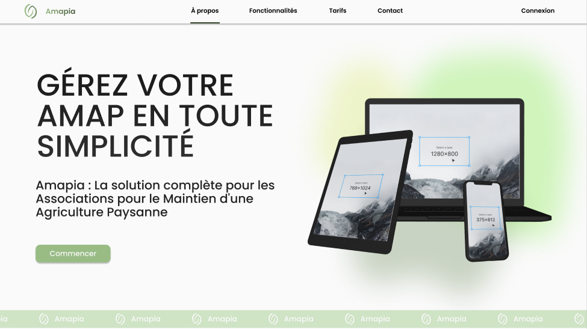

# Amapia

**Amapia** est une plateforme SaaS dédiée à la gestion des **Associations pour le Maintien d’une Agriculture Paysanne** (AMAP). Ce projet a été conçu pour faciliter et optimiser la gestion quotidienne des AMAP en offrant une solution simple et efficace à tous les acteurs impliqués : administrateurs, producteurs et adhérents. L'objectif principal de ce projet est de simplifier la gestion des adhésions, des commandes et des services pour les AMAP, en leur offrant une plateforme clé en main qui répond à leurs besoins spécifiques.

## À propos du projet

Les AMAP rencontrent des défis fréquents dans la gestion de leurs adhésions, commandes et services, ce qui complexifie leur fonctionnement quotidien et limite leur efficacité. Amapia a été créé pour résoudre ces problèmes en offrant une solution **SaaS** (Software as a Service), permettant aux AMAP de gérer leurs adhésions, leurs commandes, et leurs producteurs tout en personnalisant leur espace en fonction de leurs besoins et de leurs valeurs.

### Qu'est-ce qu'une plateforme SaaS ?

Une plateforme **SaaS** (Software as a Service) est une solution logicielle accessible directement via internet, sans nécessiter de maintenance technique ou d'installation locale. Amapia offre une solution clé en main, où l'infrastructure technique et l'hébergement sont gérés en interne, permettant aux utilisateurs de se concentrer sur l'utilisation de la plateforme sans se soucier des aspects techniques.

## Objectifs de la solution

L'objectif de **Amapia** est d'offrir un outil efficace pour :
- Simplifier la gestion administrative des AMAP.
- Améliorer l'expérience utilisateur pour les adhérents, les producteurs, et les administrateurs.
- Offrir une plateforme personnalisable selon les besoins et les valeurs de chaque AMAP.

## Fonctionnalités

Amapia permet aux AMAP de bénéficier de nombreux services, tels que :

- **Personnalisation de leur site** : Chaque AMAP peut adapter son espace selon ses besoins.
- **Gestion d'une boutique en ligne** : Mise en place de boutiques en ligne pour gérer les produits et paniers maraîchers.
- **Gestion des membres** : Suivi des adhésions, des cotisations et des commandes.
- **Organisation des activités** : Création et gestion d'ateliers, d'événements et de moments conviviaux.

## Technologies utilisées

Le projet **Amapia** a été réalisé en utilisant un ensemble d'outils variés et complémentaires, répartis en plusieurs catégories :

### Conception
- **Figma** pour les maquettes et les wireframes.
- **Draw.io** et **BPMN.io** pour les diagrammes de classes et les flux de processus.
- **Canva** pour la création d'éléments graphiques et visuels.

### Communication
- **Slack** et **Zoom** pour la collaboration et l'organisation des réunions d'équipe.

### Développement
- **Front-end** : 
  - **CSS**, **JavaScript**, **JSP** (incluant HTML), et **Bootstrap** pour créer des interfaces modernes et responsives.
- **Back-end** :
  - **Java**, **Eclipse**, **Hibernate** pour le développement backend et la gestion de la base de données MySQL.
- **Base de données** : **MySQL** pour la gestion des données des utilisateurs, des commandes, des produits, etc.

### Gestion de projet
- **Jira** pour gérer les tâches, suivre les progrès du projet et organiser les sprints.

### Versionnage
- **GitHub** pour le suivi des modifications du code et la collaboration sur le développement.

### API
- **Stripe** pour intégrer les paiements en ligne.

## Bénéfices de la digitalisation

La digitalisation des AMAP avec Amapia offre plusieurs avantages :

1. **Simplification de la gestion administrative** : La plateforme centralise toutes les informations (adhérents, commandes, produits) pour une gestion plus fluide.
2. **Accessibilité et personnalisation** : Chaque AMAP peut personnaliser son site en fonction de ses besoins, de ses valeurs et de sa structure.
3. **Gain de temps et réduction des erreurs** : L'automatisation des tâches permet de se concentrer sur l'essentiel, comme les échanges et la gestion des produits.
4. **Amélioration de l'expérience utilisateur** : Une interface simple et moderne pour les adhérents et les producteurs.

## Métriques du projet

- **91,8% Java** (avec HTML inclus dans JSP)
- **6,9% CSS**
- **1,3% JavaScript**
- **14 tables de données**